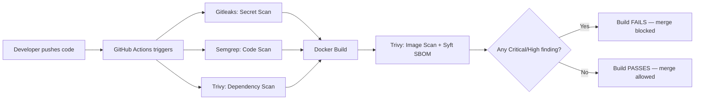

# ChainGuard — Automated DevSecOps Security Pipeline

ChainGuard is a CI/CD security pipeline that automatically scans every code
push for **secrets, vulnerable code patterns, vulnerable dependencies, and
insecure Docker images** — and blocks the build if anything critical is found.

> This repo intentionally includes a small vulnerable Flask app (`app/`) so
> the pipeline has real findings to catch. It's a controlled demo, not a
> production application.

## Why this project

Companies want to know code is safe **before** it merges, not after a breach.
ChainGuard automates that gate using the same open-source tools real
DevSecOps teams use in production: Gitleaks, Semgrep, and Trivy — orchestrated
through GitHub Actions.

## Pipeline stages



| Stage | Tool | Catches |
|---|---|---|
| Secret Scanning | **Gitleaks** | Hardcoded API keys, passwords, tokens |
| Static Code Analysis | **Semgrep** | SQL injection, `eval()` misuse, debug mode left on |
| Dependency Scanning | **Trivy (fs)** | Known CVEs in `requirements.txt` |
| Image Scanning | **Trivy (image)** | CVEs in the base Docker image + installed packages |
| SBOM Generation | **Syft** | Full inventory of what's inside the image |

## Intentional vulnerabilities in the demo app

| # | Vulnerability | File | Caught by |
|---|---|---|---|
| 1 | Hardcoded API key & DB password | `app/app.py` | Gitleaks |
| 2 | SQL Injection (string formatting into query) | `app/app.py` → `/login` | Semgrep |
| 3 | `eval()` on user input | `app/app.py` → `/calculate` | Semgrep |
| 4 | `debug=True` in "production" | `app/app.py` | Semgrep |
| 5 | Outdated Flask/Werkzeug/urllib3 with known CVEs | `app/requirements.txt` | Trivy |
| 6 | Old base image (`python:3.9-slim`) | `app/Dockerfile` | Trivy |

## Repo structure

```
ChainGuard/
├── app/                          # Intentionally vulnerable demo app
│   ├── app.py
│   ├── requirements.txt
│   └── Dockerfile
├── .github/workflows/
│   └── security-pipeline.yml     # Main CI/CD automation
├── .gitleaks.toml                # Secret scan rules
├── .semgrep.yml                  # Static analysis rules
├── reports/                      # Generated scan output (SBOM, etc.)
└── README.md
```

## How to see it work

1. Push this repo to GitHub.
2. Open the **Actions** tab — the pipeline runs automatically.
3. Each of the 5 jobs (secret, code, dependency, docker, summary) runs and
   reports pass/fail with details in the logs.
4. Because the demo app has intentional vulnerabilities, you should see the
   pipeline **fail** — proving the gate actually blocks unsafe code.
5. Fix an issue (e.g. remove the hardcoded key) and push again to see it pass.

## What I built vs. what the tools do

I didn't write Gitleaks, Semgrep, or Trivy — they're industry-standard,
open-source tools. What I built is the **automation and orchestration**:
the GitHub Actions workflow that wires them together in the right order,
the custom Semgrep/Gitleaks rules tuned for this app, the fail-the-build
logic, and the demo app used to prove it all actually works end-to-end.

## Tech stack

GitHub Actions · Gitleaks · Semgrep · Trivy · Syft · Docker · Python (Flask)
